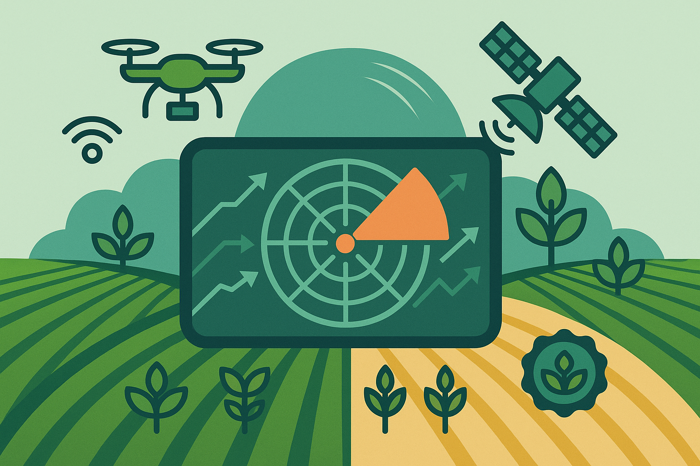

## 📡 Diagnóstico del Nivel Tecnológico

**TecnoRadar** es una herramienta interactiva desarrollada por MISS AGRO para que productores agropecuarios puedan autoevaluar el nivel de implementación tecnológica en sus sistemas productivos.

A partir de un breve cuestionario de 16 preguntas distribuidas en 8 ejes clave (como digitalización, maquinaria, decisiones agronómicas o sostenibilidad), esta app te permite:

- Clasificarte como **productor convencional**, **en transición**, **tecnificado** o **de precisión**
- Visualizar tu perfil en un gráfico radar 📊
- Recibir sugerencias personalizadas con los servicios que MISS AGRO puede brindarte para mejorar

> Esta aplicación está pensada especialmente para productores de la Provincia de Buenos Aires y zonas aledañas, con el objetivo de facilitar la toma de decisiones y la adopción de tecnologías de precisión.

---

### 🚀 Ingresá tu información y conocé tu perfil tecnológico:

<iframe src="https://missagro.shinyapps.io/TecnoRadar/" width="100%" height="800" frameborder="0"></iframe>
