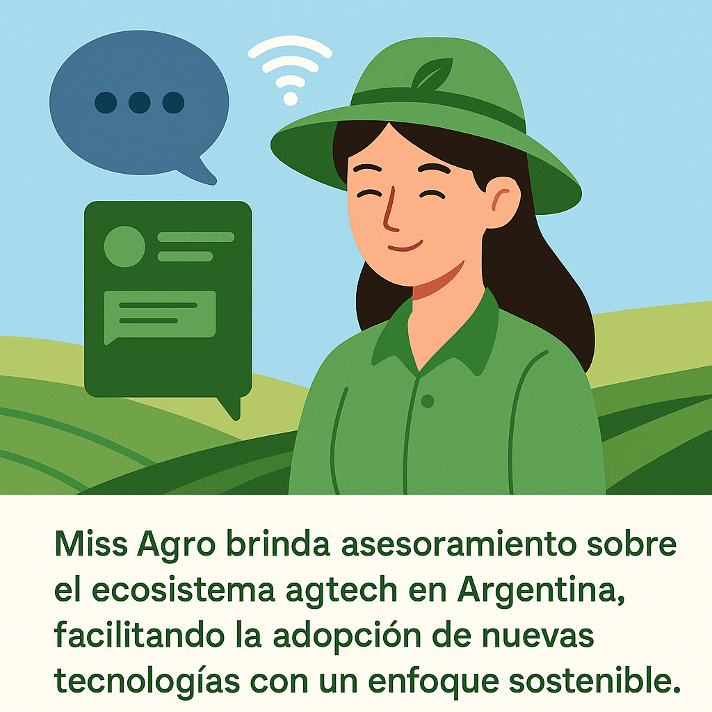

🤖 Chatbot MISS AGRO

En esta nueva sección de la plataforma, presentamos el chatbot oficial de MISS AGRO, una herramienta diseñada para brindar asesoramiento inmediato y personalizado sobre:

🌾 Tecnologías aplicadas al agro

🚜 Soluciones AgTech disponibles en Argentina

🌱 Buenas prácticas sostenibles

📲 Uso e integración de herramientas digitales

Este asistente inteligente tiene como objetivo acercar la innovación al productor, derribando barreras tecnológicas y facilitando la adopción de nuevas herramientas que mejoren la eficiencia, la rentabilidad y la sostenibilidad del sistema agropecuario.

Disponible como ventana emergente (pop-up) en la parte inferior derecha de esta página, el chatbot puede ayudarte a:

Descubrir empresas, startups y desarrollos AgTech en tu región.

Resolver dudas sobre sensores, plataformas, maquinaria conectada, agricultura de precisión, apps, mapas, etc.

Comprender cómo aplicar tecnología en tu campo, paso a paso.

Acceder a recomendaciones en tiempo real adaptadas a tu perfil como productor o asesor.

💡 El chatbot se actualiza de manera continua con información verificada, relevante y contextualizada al territorio argentino.

Con MISS AGRO, la tecnología está al alcance de un clic. Explorá esta herramienta y animate a transformar tu campo con innovación.